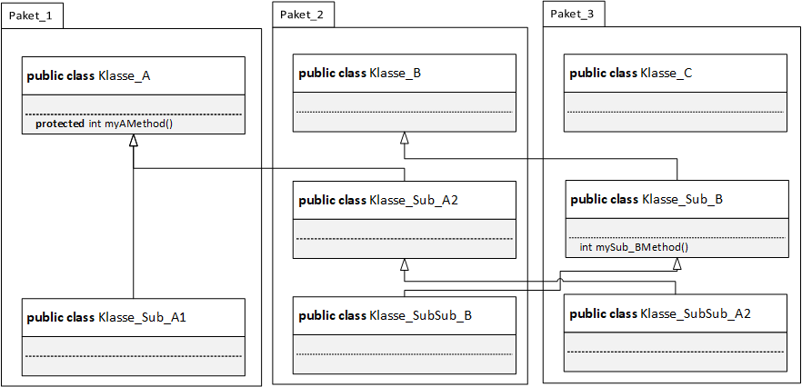

***protected*** int myAMethod(){}  
***package-private*** 

| Klasse              | Paket     | myAMethod() | mySub_BMethod() |
|---------------------|-----------|-------------|------------------|
| Klasse_A            | Paket_1   | +           | –                |
| Klasse_Sub_A1       | Paket_1   | +           | –                |
| Klasse_B            | Paket_2   | –           | –                |
| Klasse_Sub_A2       | Paket_2   | +           | –                |
| Klasse_SubSub_A2    | Paket_3   | +           | +                |
| Klasse_C            | Paket_3   | –           | +                |
| Klasse_Sub_B        | Paket_3   | –           | +                |
| Klasse_SubSub_B     | Paket_2   | –           | –                |
