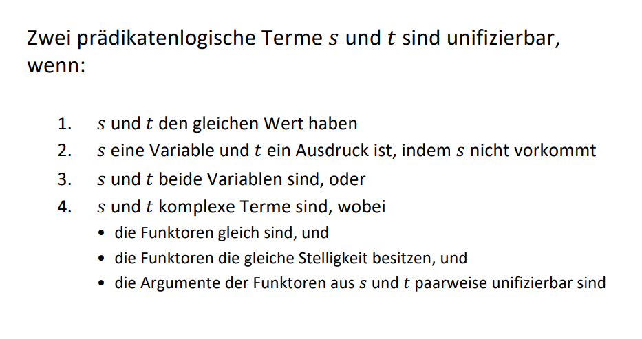

### 1.
```prolog
A = Bread  
B = fish
Bread - variable. fish - nicht in Bread. //regel 2.
Unifikator σ: { Bread = fish }
```
### 2.
```prolog
A = bread  
B = fish
Beide sind variabeln mit verschiedene Werten. //regel 1
Nicht unifizierbar.
Unifikator σ: — (nicht möglich)
```
### 3.
```prolog
A = eatWith(bread, X); 
B = eatWith(Y, knife)
Gleichen funktoren mit gleiche Stelligkeit.
Unifizierbar: Ja
Unifikator σ: { X = knife, Y = bread } 
```
### 4.
```prolog
A = lunch(person(X), eatWith(Y, fork));
B = lunch(eatWith(Y, fork), person(X))
person(X) und eatWith(Y, fork) haben unterschiedliche Funktoren → können nicht unifiziert werden
eatWith(Y, fork) vs. person(X) → wieder unterschiedliche Funktoren
```
### 5.
```prolog
A = lunch(person(X), eatWith(Y, fork))  
B = lunch(person(paul), Z)
person(X), person(Y, fork) -> gleiche Funktoren -> X=paul
person(paul), Z -> Z - variable, Z=person(paul)
Unifizierbar: Ja
Unifikator σ: { X = paul, Z = eatWith(Y, fork) } 
```
### 6.
```prolog
A = lunch(person(x)); 
B = lunch(C, D)
??
```
### 7.
```prolog
A = food(X)  
B = food([bread, sausage, banana, apple])
X - variable
[bread, sausage, banana, apple] ist eine konkrete Liste
Regel 2: X = [bread, sausage, banana, apple] ist gültig
Unifizierbar: Ja
Unifikator σ: { X = [bread, sausage, banana, apple] }
```
### 8.
```prolog
A = drinks(X, Y, Z | More)  
B = drinks([milk, water])
A - pradikat mit 4 argumenten
B - pradikat mit 1 argument
Wegen regel 4: nicht unifizierbar
```
### 9.
```prolog
A = mixDrinks([DrinkA, DrinkB], [DrinkC], [DrinkA, DrinkB, DrinkC])  
B = mixDrinks([DrinkA], [DrinkB, DrinkC], [DrinkA, DrinkB, DrinkC])
Unterschiedliche lange der Listen.
Unifizierbar: Nein
Unifikator σ: — (nicht möglich)
```
### 10.
```prolog
A = food(X)  
B = X
X = food(X) - nicht erlaubt, regel 2.
Unifizierbar: Nein
Unifikator σ: — (nicht möglich)
```
### 11.
```prolog
A = food(Y)  
B = X
X = food(Y) - kann sein
Unifizierbar: Ja
Unifikator σ: { X = food(Y) }
```